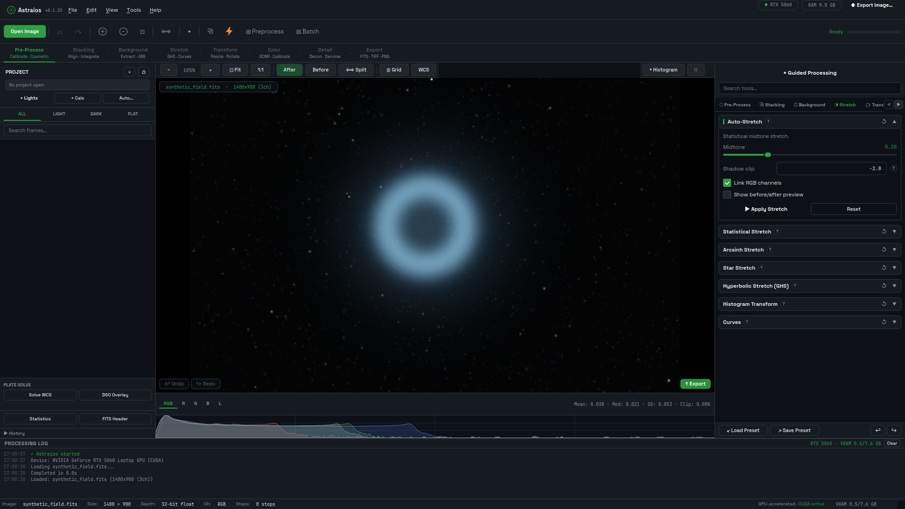

# Astraios — Free GPU-Accelerated Astrophotography Processing

Astraios is a free, open-source desktop application for calibrating, registering, stacking and processing deep-sky, planetary and solar astrophotography on Windows, Linux and macOS. Supported operations use NVIDIA CUDA or Apple Metal acceleration with automatic CPU fallback. Image processing and AI inference run locally; explicitly selected online integrations such as astrometry.net transmit only the data that service needs. Astraios is alpha software.

[](LICENSE)
[](https://github.com/majmichu1/Astraios/releases/latest)
[](docs/project-facts.md#version-and-maturity)
[](https://github.com/majmichu1/Astraios/actions/workflows/ci.yml)
[](https://github.com/majmichu1/Astraios/actions/workflows/validate-installer.yml)
[](https://buymeacoffee.com/majmichu)

**Alpha.** Workflows are complete end to end, but expect rough edges. Bug reports and compatibility reports are welcome in [Issues](https://github.com/majmichu1/Astraios/issues).



*The image above is a synthetic test field rendered by `scripts/ui_screenshots.py`, shown to illustrate the interface, not a processing result.*

## Download

**[Download the latest release](https://github.com/majmichu1/Astraios/releases/latest)** (v0.1.25-alpha) · [Website](https://majmichu1.github.io/Astraios/) · [Changelog](CHANGELOG.md)

Installers are small. They set up a private Python environment, detect your GPU and download the matching PyTorch build (about 2 GB for CUDA), so there is no Python setup and no manual CUDA install.

## Why Astraios

- **GPU-accelerated where it matters, with automatic CPU fallback.** Registration, rejection and integration, drizzle, deconvolution, wavelets, denoising, stretching and AI inference run on CUDA or Apple Metal; every tool still works on a CPU-only machine.
- **A guided workflow, not a wall of dialogs.** Guided Processing walks the correct order one step at a time, suggests settings measured from your own image and previews before committing. Every control explains what turning it up or down does.
- **Local-first and free.** GPL-3.0-or-later, no account, no licence key, no telemetry. AI denoise ships bundled; deconvolution, star removal and colour calibration are built in rather than paid plugins.

## Install

| Platform | Get | Then |
|---|---|---|
| Windows 10/11 (x64) | `Astraios-Setup-<version>.exe` | Run it. NVIDIA GPUs get CUDA PyTorch, everything else CPU PyTorch. |
| Linux (x86_64) | `install-astraios.sh` | `bash install-astraios.sh`. Installs into your home directory, no root, no system Python; works on Fedora, Bazzite, Ubuntu, Arch. |
| Linux, portable | `Astraios-<version>-x86_64.AppImage` | `chmod +x` and run. PyTorch is provisioned per user on first launch. |
| macOS 11+ (Apple Silicon and Intel) | `install-astraios-macos.sh` | `bash install-astraios-macos.sh`. Creates `Astraios.app`; Apple Silicon runs on Metal, Intel on CPU. |

Details, uninstall and troubleshooting: [docs/installation.md](docs/installation.md).

## Verified compatibility

| | Checked in CI on every packaging change | Verified by a person |
|---|---|---|
| Windows x64 | Installer, PyTorch, app launch (CPU build; runners have no GPU) | |
| Linux x86_64 | Installer end to end (CPU build) | Maintainer: NVIDIA RTX 5060 Laptop GPU, CUDA 12.8, Bazzite |
| macOS Apple Silicon | Installer, `Astraios.app`, Metal backend, Metal-vs-CPU pixel parity | |
| macOS Intel | Installer, CPU path | |
| NVIDIA CUDA | Not testable on hosted runners | Maintainer's machine only so far |

AMD and Intel GPUs are not accelerated; those machines run the CPU path. If you run Astraios on hardware not listed here, please file a [compatibility report](https://github.com/majmichu1/Astraios/issues/new?template=compatibility_report.yml).

## Workflow

1. **Load** lights, darks, flats and bias frames into a project (FITS, XISF, TIFF, PNG, JPEG; SER video for planetary).
2. **Calibrate and cull**: master frames, cosmetic correction, subframe scoring.
3. **Register and stack**: star or triangle matching on the GPU, winsorized or sigma rejection, optional drizzle, multi-session and live stacking.
4. **Guided Processing** (Ctrl+G): crop, gradient removal, colour calibration (PCC/SPCC/SFCC), deconvolution, denoise, stretch, saturation, each step previewed and explained.
5. **Finish**: narrowband palettes, star removal and recombination, layers and effects, annotation, export to FITS/XISF/TIFF/PNG/JPEG.

Everything is recorded in a non-destructive history you can replay or export as a macro. Full guide: [docs/workflow.md](docs/workflow.md).

### Five-minute start

1. Install (table above) and launch. The log panel shows the device in use: `CUDA`, `MPS` or `CPU`.
2. Open a stacked image (File > Open, or drag a FITS/XISF/TIFF onto the canvas), or add lights and calibration frames to a project and run Stacking.
3. Press Ctrl+G for Guided Processing and follow the steps; each one previews before it applies.
4. Export from File > Save Image As (16-bit TIFF for editing, PNG or JPEG for sharing).

Smart telescope files (Seestar, Dwarf, Vespera, Stellina, Unistellar) are recognised from their headers and sent straight to the guided workflow.

## AI tools: what ships

| Tool | Model | Ships with the app | Fallback |
|---|---|---|---|
| AI Denoise | Noise2Self U-Net | Yes, bundled | Classical denoise (TGV, wavelet, NLM) |
| AI Super-Resolution | Real-ESRGAN x2/x4 | Downloaded from the upstream GitHub release on first use (about 67 MB) | Lanczos resampling |
| AI Sharpen | No trained model is published yet | No | Richardson-Lucy deconvolution |
| Star removal | Morphological remover | Yes | StarNet if you install it (runs as a separate process) |
| Cosmic Clarity models | Third-party | No; optional, user-installed | Built-in tools |

Inference runs on the local GPU or CPU. Nothing is sent to a server.

## Privacy and network use

There is no telemetry, no account and no licence check. Network access is on demand only:

| When | Where | What is sent |
|---|---|---|
| Startup update check (Preferences > Updates, on by default) | `api.github.com` | A request for the latest release; nothing about you or your images |
| First use of AI Super-Resolution | GitHub (Real-ESRGAN release) | Downloads the weights |
| Gaia catalog and minor-body downloads | Seti Astro data hosting | Downloads catalog files |
| Object identification, Smart Processor | SIMBAD, VizieR, hips2fits (CDS) | Coordinates and object names from your plate solve |
| Plate solving with the astrometry.net backend selected and an API key set | `nova.astrometry.net` | Uploads a 16-bit mono FITS copy of the image being solved; ASTAP and the local Gaia solver work offline |

File-level references for every call: [docs/project-facts.md](docs/project-facts.md#local-processing-network-use-uploads-telemetry).

## Features

| Area | Highlights |
|---|---|
| Pre-processing | Calibration masters, batch preprocessing, cosmetic correction, subframe selector, debayer, pedestal |
| Registration and stacking | Star, triangle, FFT and comet alignment; sigma, winsorized, linear-fit, percentile, ESD, min/max rejection; drizzle 2x/3x; multi-session; live stacking; SER lucky imaging; multi-frame deconvolution |
| Gradients and colour | Polynomial, ABE and DBE background extraction; PCC, SPCC, SFCC; background neutralization; SCNR; linear fit; curves; GHS; arcsinh; PixelMath |
| Detail and noise | Richardson-Lucy, spatially varying and multi-frame deconvolution; wavelets; TGV, NLM and chroma denoise; AI denoise (bundled); AI super-resolution; star reduction; halo reduction |
| Narrowband | HOO/SHO and 12 named palettes, normalization, continuum subtraction, star colour recovery, LRGB and channel combine, HDR |
| Science | Aperture photometry and magnitudes, exoplanet transit light curves, transient hunter, isophotes, SNR, dither analysis |
| Plate solving and annotation | Offline local Gaia DR3 solver, ASTAP, astrometry.net; WCS overlay, DSO labels, constellations, finder chart, what's in my image / my sky, minor bodies |
| Workflow | Guided Processing, Smart Processor, non-destructive history, macros, batch processing, Python console, plugins, layers, image peeker |

The complete inventory with every tool and its options is in [docs/features.md](docs/features.md).

## Measurements

Astraios ships a benchmark harness (`scripts/benchmark.py`) and a method for fair timing against other tools; see [docs/BENCHMARKS.md](docs/BENCHMARKS.md). No Astraios-versus-Siril speedup is published, because both tools have not yet been timed on the same data with comparable settings. What has been measured, on the same 50 subs with matched settings and the same reference frame: Astraios and Siril 1.4.4 produce the same star peaks (ratio 1.005) and the same star FWHM (3.76 vs 3.79 px); Siril's registered frames are about 10% quieter at the single-pixel scale, and the two are equal at 4x4 binning and coarser. Method and numbers: [docs/BENCHMARKS.md](docs/BENCHMARKS.md#quality-comparison-with-siril).

## How it compares

Checked against official documentation on 2026-09-01; versions: Siril 1.4.4, PixInsight 1.9.4. Full, sourced comparisons: [Astraios vs Siril](https://majmichu1.github.io/Astraios/compare/siril/) and [Astraios vs PixInsight](https://majmichu1.github.io/Astraios/compare/pixinsight/).

| | Astraios 0.1.25 (alpha) | Siril 1.4.4 | PixInsight 1.9.4 |
|---|---|---|---|
| Price and licence | Free, GPL-3.0-or-later | Free, GPL-3.0 | 300 EUR plus VAT, proprietary |
| Core-engine GPU acceleration | CUDA and Apple Metal for the operations listed above; CPU fallback | None in the core engine (multithreaded CPU); GPU only inside third-party tools it can call | None in the core as of 1.9.4; GPU inside paid third-party plugins (RC Astro) |
| AI denoise | Built in, bundled model | Via external tools (GraXpert, RC Astro) | Paid plugin (NoiseXTerminator) |
| Deconvolution | Built in, incl. spatially varying and multi-frame | Built in (classical) | Built in (classical); AI via paid plugin |
| Guided step-by-step workflow | Yes | No | No |
| Maturity and ecosystem | Alpha, one maintainer, since 2026 | Stable since 2005, large community | Commercial since 2007, large plugin ecosystem |

Feature names that look alike are not a claim of parity; PixInsight and Siril are mature tools with years of refinement that Astraios does not have yet.

## Known limitations

- Alpha: bugs are expected and some tools are less refined than their PixInsight or Siril equivalents.
- No camera raw support (CR2, NEF, ARW, DNG); convert to FITS or TIFF first.
- GPU acceleration is NVIDIA CUDA and Apple Metal only; the CUDA path is verified on one machine, not in CI.
- AI Sharpen has no published model yet and falls back to Richardson-Lucy.
- First install downloads about 2 GB of PyTorch; Windows builds are unsigned, so SmartScreen may warn.

## FAQ

**Is it a PixInsight alternative?** For calibration through final processing on deep-sky data, yes, with a guided workflow and no licence fee, but at alpha maturity. See the [comparison](https://majmichu1.github.io/Astraios/compare/pixinsight/).

**Does it work without an NVIDIA card?** Yes. Apple Silicon uses Metal; every other machine runs the CPU path with the same features.

**Does it upload my images or collect telemetry?** No telemetry. Processing and AI inference are local. The only upload is the astrometry.net solver, and only if you select it and provide an API key; ASTAP and the local Gaia solver work offline. The startup update check can be turned off in Preferences. Details: [docs/project-facts.md](docs/project-facts.md#local-processing-network-use-uploads-telemetry).

**Do the installers need Python or CUDA installed?** No. They bring their own Python and download the matching PyTorch build.

**Is it production ready?** No. It is alpha software under active development on the `main` branch; tagged releases are the more stable option.

**Was this called Cosmica?** Yes, until June 2026. Old releases and some internal file names keep that name.

## Documentation and community

- [Project facts](docs/project-facts.md) (source of truth for every public claim) · [Installation](docs/installation.md) · [Getting started](docs/getting-started.md) · [Workflow](docs/workflow.md) · [Features](docs/features.md) · [Tools reference](docs/tools.md) · [Benchmarks](docs/BENCHMARKS.md)
- Questions: [Discussions](https://github.com/majmichu1/Astraios/discussions) · Bugs: [Issues](https://github.com/majmichu1/Astraios/issues) · Security: [SECURITY.md](SECURITY.md) · [Support](SUPPORT.md)
- [Contributing](CONTRIBUTING.md) · [Code of conduct](CODE_OF_CONDUCT.md) · [Credits](CREDITS.md) · [Citation](CITATION.cff)

## Developers

```bash
git clone https://github.com/majmichu1/Astraios.git
cd Astraios
poetry install --with dev      # Python 3.11 to 3.14
poetry run astraios            # run the app
poetry run pytest              # full suite (about 2300 tests)
poetry run ruff check .        # lint
```

`main` runs ahead of the tagged releases and is less stable. GPU code goes through `astraios/core/device_manager.py`; images are float32 arrays in [0, 1], mono `(H, W)` or colour `(C, H, W)`. Layout: `astraios/core` (processing), `astraios/ai` (inference, training, model management), `astraios/ui` (PyQt6), `astraios/updater`, `astraios/plugins`, `packaging/` (installers, built by `.github/workflows/build.yml`). Training your own denoise model: `scripts/train_denoise_model.py` (Noise2Self, no clean references needed).

## License and credits

GNU General Public License, version 3 or (at your option) any later version (SPDX `GPL-3.0-or-later`; the unmodified licence text is in [LICENSE](LICENSE), project notices in [NOTICE](NOTICE)), required by PyQt6. Several tools are ported from [Seti Astro Suite Pro](https://github.com/setiastro/setiastrosuitepro) by Franklin Marek (GPL-3.0-or-later) with attribution in each module and in [CREDITS.md](CREDITS.md). Built on PyQt6, PyTorch, Astropy, OpenCV, scikit-image, PyWavelets and uv.
